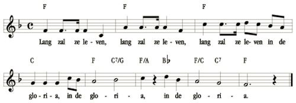

[Sonic Pi](http://sonic-pi.net/) is an application for scripting music, available on Raspberry PI, Mac OS and 
Windows

*Note that currently as the installation process for windows is brand new you'll get a warning that the application is "not commonly downloaded" so in fact by downloading and installing it you're helping the [author](https://twitter.com/samaaron/status/1246228442250706945)*

For my birthday I've scripted my own birthday song (langzalikleven.rub)  

But I'm afraid my family will start singing nervertheless. If you also want to enjoy my scripted music, you can copy the contents and paste it into Sonic PI (after installing it) or you can run it with 

    run_file "/your/path/to/langzalikleven.rub"
	
And press run.

Be aware that I'm by no means a musician and I may have missed a few flats or sharps. Don't complain, contribute!

Checkout the nice tutorial in Sonic PI itself(English) and more information on Google and a very nice [Dutch tutorial](https://coderdojo-leiden.github.io/)

I hope you have at least as much fun as we have with programming music on Sonic PI!
